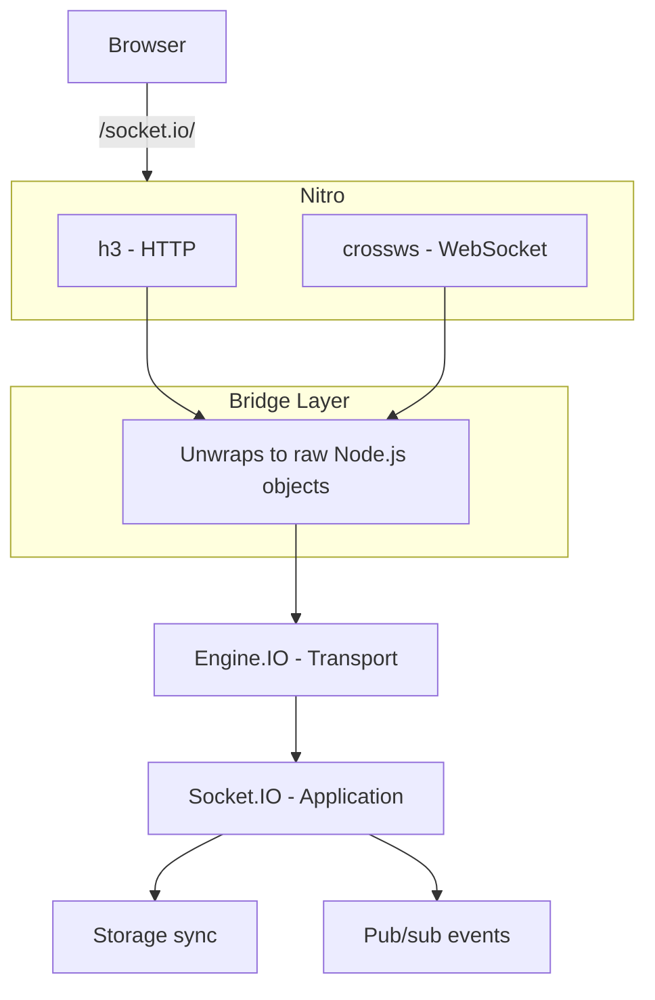

Nuxt Realtime connects four systems together:

1. **Nitro** - Nuxt's server engine, handling all HTTP and WebSocket traffic
2. **h3 / crossws** - The lower-level frameworks Nitro builds on (h3 for HTTP, crossws for WebSockets)
3. **Engine.IO** - Socket.IO's transport layer, which works directly with raw Node.js primitives
4. **Socket.IO** - The application-level library that gives us rooms, events, and acknowledgements

The tricky part is that Nitro wraps Node.js primitives in its own abstractions, but Engine.IO and Socket.IO expect raw Node.js objects. The server plugin bridges that gap.

For how cross-server sync works on top of this, see [Notification Layer](/technical/pubsub) and [Multi-Server Sync](/technical/cross-server-sync).

## Connection flow



## The bridge layer

Everything goes through a route handler registered at `/socket.io/`. It's an h3 event handler with two hooks: one for HTTP, one for WebSocket:

```ts
nitroApp.router.use('/socket.io/', defineEventHandler({
  handler(event) {
    // HTTP requests (long-polling transport)
    // Unwrap h3's H3Event to get the raw Node.js req/res
    engine.handleRequest(event.node.req, event.node.res)
    event._handled = true
  },
  websocket: {
    open(peer) {
      // WebSocket connections
      // Unwrap crossws's Peer to get the raw Node.js request and socket
      engine.prepare(peer._internal.nodeReq)
      engine.onWebSocket(
        peer._internal.nodeReq,
        peer._internal.nodeReq.socket,
        peer.websocket
      )
    },
  },
}))
```

Each layer produces different objects, and Engine.IO needs the raw Node.js ones:

| Layer | Provides |
|-------|----------|
| **Nitro/h3** | `H3Event` with `event.node.req` / `event.node.res` |
| **crossws** | `Peer` with `peer._internal.nodeReq` / `peer.websocket` |
| **Engine.IO** | Expects raw `IncomingMessage` + `ServerResponse` (HTTP) or `IncomingMessage` + `Socket` + `WebSocket` (WS) |

The bridge just extracts the right objects and passes them through.

### HTTP vs WebSocket transports

Socket.IO supports two transports:

- **HTTP long-polling** - Used as a fallback or during the initial handshake. Goes through h3's `handler()`.
- **WebSocket** - The primary transport. Goes through crossws's `websocket.open()` hook.

Engine.IO upgrades from long-polling to WebSocket automatically when possible.

## Socket.IO and Engine.IO binding

The two are wired together with a single call:

```ts
const engine = new Engine()
const io = new Server()
io.bind(engine)
```

Engine.IO handles the raw connection; Socket.IO handles the event API on top.

## Data flow example

What happens when a client calls `useRealtimeState('counter', 0)` and updates the value:

1. The client emits a `storage:set` event with `{ key: 'counter', value: 1 }`
2. The message travels over the WebSocket to Nitro
3. crossws passes it to the bridge, which hands it to Engine.IO
4. Engine.IO passes it up to Socket.IO
5. The `storage:set` handler stores the value via Nitro's storage and broadcasts `storage:updated` to the `key:counter` room. If a key is removed elsewhere in the server, the watch callback emits `storage:updated` with `value: null` to the same room.
6. Other clients in that room receive the update, reset on removal, and their local state refreshes
