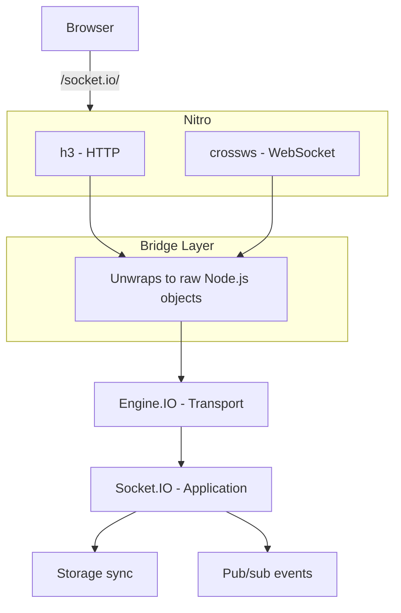

This page explains how Nuxt Realtime bridges multiple layers to deliver WebSocket-based real-time functionality inside a Nuxt application.

## Overview

Nuxt Realtime connects four systems together:

1. **Nitro** — Nuxt's server engine, responsible for all HTTP and WebSocket handling
2. **h3 / crossws** — The low-level frameworks Nitro uses (h3 for HTTP, crossws for WebSockets)
3. **Engine.IO** — Socket.IO's transport layer, which manages connections over raw Node.js primitives
4. **Socket.IO** — The application-level library that provides rooms, events, and acknowledgements

The challenge is that Nitro wraps Node.js primitives in its own abstractions, while Engine.IO and Socket.IO expect raw Node.js objects. The server plugin acts as a bridge between these two worlds.

## Connection Flow



## The Bridge Layer

The most important piece is the route handler registered at `/socket.io/`. This is a Nitro plugin that registers an h3 event handler with both HTTP and WebSocket hooks:

```ts
nitroApp.router.use('/socket.io/', defineEventHandler({
  handler(event) {
    // HTTP requests (long-polling transport)
    // Unwrap h3's H3Event to get the raw Node.js req/res
    engine.handleRequest(event.node.req, event.node.res)
    event._handled = true
  },
  websocket: {
    open(peer) {
      // WebSocket connections
      // Unwrap crossws's Peer to get the raw Node.js request and socket
      engine.prepare(peer._internal.nodeReq)
      engine.onWebSocket(
        peer._internal.nodeReq,
        peer._internal.nodeReq.socket,
        peer.websocket
      )
    },
  },
}))
```

### Why is this needed?

Without this bridge, Nitro and Socket.IO cannot communicate:

| Layer | Expects | Provides |
|-------|---------|----------|
| **Nitro/h3** | — | `H3Event` with `event.node.req` / `event.node.res` |
| **crossws** | — | `Peer` with `peer._internal.nodeReq` / `peer.websocket` |
| **Engine.IO** | Raw `IncomingMessage` + `ServerResponse` (HTTP) or `IncomingMessage` + `Socket` + `WebSocket` (WS) | — |

The bridge simply extracts the raw Node.js objects from Nitro's wrappers and passes them to Engine.IO.

### HTTP vs WebSocket

Socket.IO supports two transports:

- **HTTP long-polling** — Used as a fallback or during the initial handshake. Requests go through h3's `handler()`, where `event.node.req` and `event.node.res` give access to the underlying Node.js HTTP objects.
- **WebSocket** — The primary transport. Connections go through crossws's `websocket.open()` hook, where `peer._internal` exposes the underlying Node.js request and socket.

Engine.IO automatically upgrades from long-polling to WebSocket when possible.

## Socket.IO ↔ Engine.IO Binding

Socket.IO and Engine.IO are connected with a single call:

```ts
const engine = new Engine()
const io = new Server()
io.bind(engine)
```

This tells Socket.IO to use the Engine.IO instance as its transport. Engine.IO handles the raw connection management, while Socket.IO provides the high-level event API on top.

## Data Flow Example

Here's what happens when a client calls `useRealtimeState('counter', 0)` and then updates the value:

1. The client's Socket.IO instance sends a `storage:set` event with `{ key: 'counter', value: 1 }`
2. The message travels over the WebSocket connection to Nitro
3. Nitro's crossws passes it to the bridge, which hands it to Engine.IO
4. Engine.IO passes it up to Socket.IO
5. The Socket.IO `storage:set` handler stores the value via unstorage and broadcasts `storage:updated` to all clients in the `key:counter` room
6. Other connected clients receive the update and reactively update their local state
