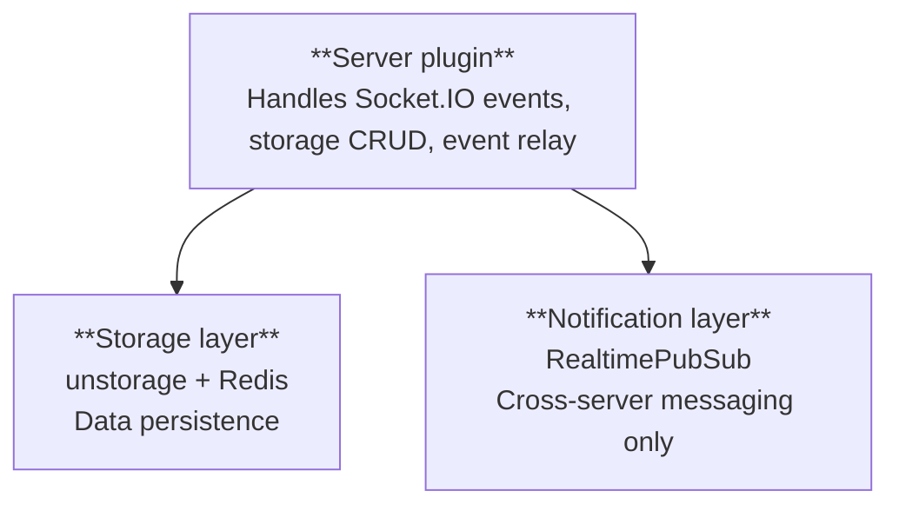
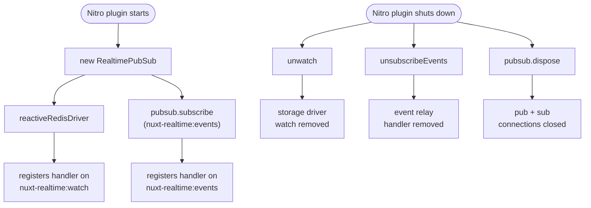

Cross-server sync is split into two separate concerns: storing data and notifying other servers that something changed. This page covers the notification side.

## Two layers, two responsibilities



The **storage layer** (backed by [unstorage](https://unstorage.unjs.io/)) owns all data. Reads and writes go through here.

The **notification layer** (`RealtimePubSub`) owns no data at all. Its only job is to tell other server instances that something happened. It forwards the payload but never persists it.

Keeping them separate means you can reason about each independently. A storage problem won't affect the messaging path, and the other way around.

## RealtimePubSub

`RealtimePubSub` is a class exported from `nuxt-realtime/drivers/redis`. It holds exactly two Redis connections for the lifetime of the server process:

| Connection | Direction | Purpose |
|------------|-----------|---------|
| `pub` | outbound | Publishes messages to Redis channels |
| `sub` | inbound | Subscribes to Redis channels and dispatches incoming messages |

Multiple features (storage sync and event relay) share these two connections. There are no extra connections per feature.

```ts
const pubsub = new RealtimePubSub({ host: 'localhost', port: 6379 })

// Subscribe to a channel, returns an unsubscribe function
const unsub = pubsub.subscribe('some-channel', (message) => {
  const payload = JSON.parse(message)
  // handle payload
})

// Publish to a channel
await pubsub.publish('some-channel', { hello: 'world' })

// Clean up both connections
await pubsub.dispose()
```

## Channels

Two Redis channels are used internally:

| Channel | Used by | Payload |
|---------|---------|---------|
| `nuxt-realtime:watch` | Reactive storage driver | `{ event, key, origin }` |
| `nuxt-realtime:events` | Event relay | `{ channel, data, origin }` |

Both include an `origin` field with the `instanceId` of the server that sent the message.

## Deduplication via instanceId

Each `RealtimePubSub` instance generates a UUID when it starts up. Every published message includes this as `origin`.

When a message comes in over the subscriber connection, the server compares `origin` to its own `instanceId` and skips the message if they match. This stops the publishing server from reacting to its own broadcast:

```
Server A publishes -> Redis pub/sub -> Server A receives (origin matches, skip)
                                    -> Server B receives (origin differs, relay)
                                    -> Server C receives (origin differs, relay)
```

Without this, Server A would broadcast every change twice: once from the direct Socket.IO emit, and once from the pub/sub relay.

## Connection lifecycle

`RealtimePubSub` starts up once per server process inside the Nitro plugin, before any Socket.IO connections come in. It gets passed to the storage driver so both features share the same instance.



## No Redis configured

When no Redis options are set (common in local development), `RealtimePubSub` is never created and the plugin runs in single-instance mode:

- Storage updates only reach clients on the same server.
- Events only reach subscribers on the same server.

