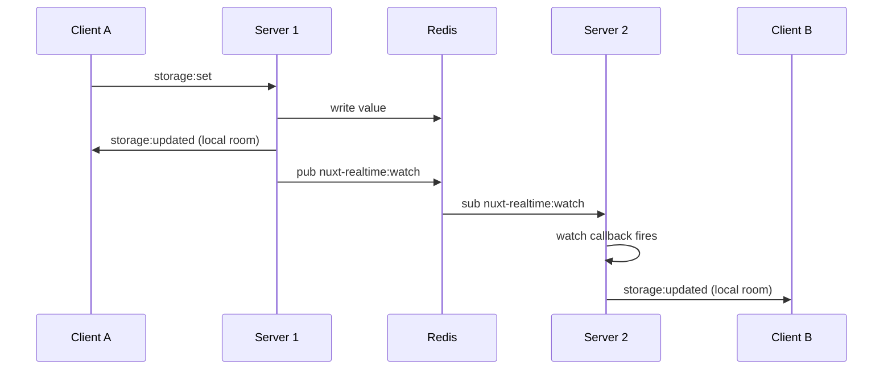
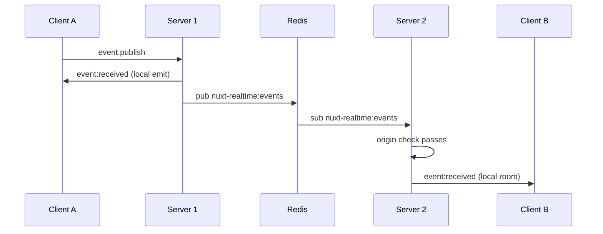

By default, clients connected to the same server see each other's updates in real time. To make that work across multiple server instances, you need Redis.

## Configuration

Add Redis connection details to your `nuxt.config.ts`:

```ts [nuxt.config.ts]
export default defineNuxtConfig({
  modules: ['nuxt-realtime'],
  nuxtRealtime: {
    redis: {
      host: 'localhost',
      port: 6379,
      // or: url: 'redis://localhost:6379'
      // password: '...',
      // db: 0,
    }
  }
})
```

That's all. Both of these work automatically once Redis is configured:

- **Reactive state sync**: storage writes on any instance get broadcast to subscribers on all other instances
- **Cross-server event relay**: events published via `useRealtimeEvents` on any instance reach subscribers everywhere

## How state sync works



1. Client A emits `storage:set` or server-side code calls `storage.removeItem()`, which updates Redis and immediately emits `storage:updated` to the local room.
2. The change also publishes a notification to `nuxt-realtime:watch`.
3. Server 2 picks up the message, reads the current value from Redis, and broadcasts `storage:updated` to its local room. For removals, that value is `null`.
4. Client B receives the update or reset.

Server 1 won't double-broadcast to its own clients because the `origin` field on the pub/sub message matches its own `instanceId`. See [Notification Layer](/technical/pubsub#deduplication-via-instanceid) for details.

## How event relay works



1. Client A emits `event:publish` to Server 1, which immediately broadcasts `event:received` to local subscribers.
2. Server 1 publishes the event payload (with its `instanceId` as `origin`) to `nuxt-realtime:events`.
3. Server 2 receives the message, sees the origin doesn't match its own ID, and relays it to its local Socket.IO room.
4. Client B receives the event.

The `includeSelf` option controls whether the publishing socket sees its own event. That's handled entirely in the local broadcast step and has no effect on how the relay works.

## Redis connections

Enabling Redis opens exactly two connections per server instance. Storage sync and event relay share a single `RealtimePubSub` with one `pub` and one `sub` connection.

| Connection | Role |
|------------|------|
| `pub` | Publishes storage and event notifications |
| `sub` | Subscribes to `nuxt-realtime:watch` and `nuxt-realtime:events` |

## No Redis configured

Without Redis the module falls back to single-server behavior. No client-side changes needed. Startup warnings will tell you sync is disabled.
